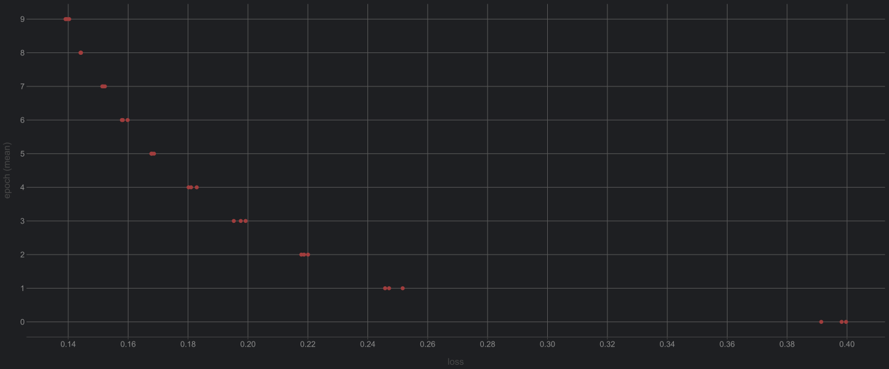
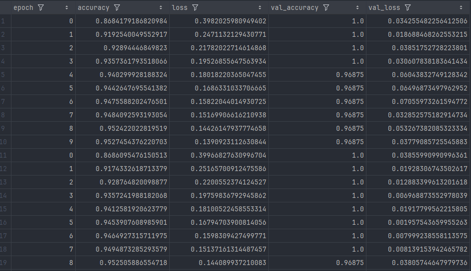
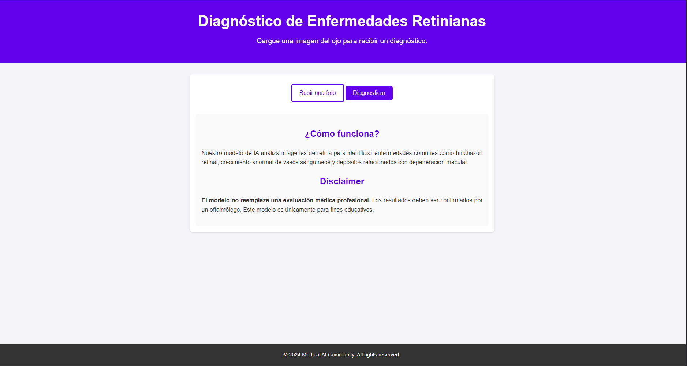

# 🩺 Diagnóstico de Enfermedades Retinianas
Aplicación web desarrollada con Flask para diagnosticar enfermedades retinianas mediante modelos de clasificación de imágenes y aprendizaje automático.

### Grafica de Resultados en el entrenamiento

### Tabla de Resultados en el entrenamiento



## 📋 Descripción del Proyecto

Esta aplicación permite cargar imágenes de retina para su análisis y diagnóstico automatizado. Se emplean modelos de visión por computadora entrenados con datasets especializados en patologías oculares.

## 📊 Datasets Utilizados

- **Retinal OCT Dataset** [Dataset a descargar](https://www.kaggle.com/datasets/paultimothymooney/kermany2018)

## ⚙️ Tecnologías y Herramientas

- **Backend**: Flask
- **Preprocesamiento de Imágenes**: `image.load_img`, `image.img_to_array`, normalización `/255`
- **Modelos**: Redes Neuronales Convolucionales (CNN)
- **Librerías**: TensorFlow, Keras, NumPy, OpenCV

## 🚀 Funcionalidades

- Carga de imágenes de retina para análisis.
- Diagnóstico automatizado de diversas enfermedades retinianas.
- Interfaz web intuitiva para facilitar su uso a profesionales de la salud.

## 🛠️ Instalación y Ejecución

1. **Clona el repositorio**:

   ```bash
   git clone https://github.com/tu-usuario/diagnostico-retiniano.git
   cd diagnostico-retiniano
2. **Crea y activa un entorno virtual**:

    ```bash
    Copiar código
    python -m venv venv
    source venv/bin/activate  # En Windows: venv\Scripts\activate
   Instala las dependencias:
3. **Instala las dependencias**:

   ```bash
   Copiar código
   
   bash
   Copiar código
   pip install -r requirements.txt
4. **Descarga el Dataset Retinal Octo que se menciona arriba**

5. **Ejecuta la aplicación**:

   ```bash
   Copiar código
   python app.py
6. **Accede a la aplicación en tu navegador en http://127.0.0.1:5000**

## 📁 Estructura del Proyecto

      
      diagnostico-retiniano/
      │-- app.py
      │-- templates/
      │   └── index.html
      │-- static/
      │   └── css/
      │-- models/
      │   └── modelo_retiniano.h5
      │-- requirements.txt
      └-- README.md


## 📸 Ejemplo de Uso
- **Subir una imagen de retina desde la interfaz web.**
- **La aplicación procesa la imagen y muestra el diagnóstico correspondiente.**


